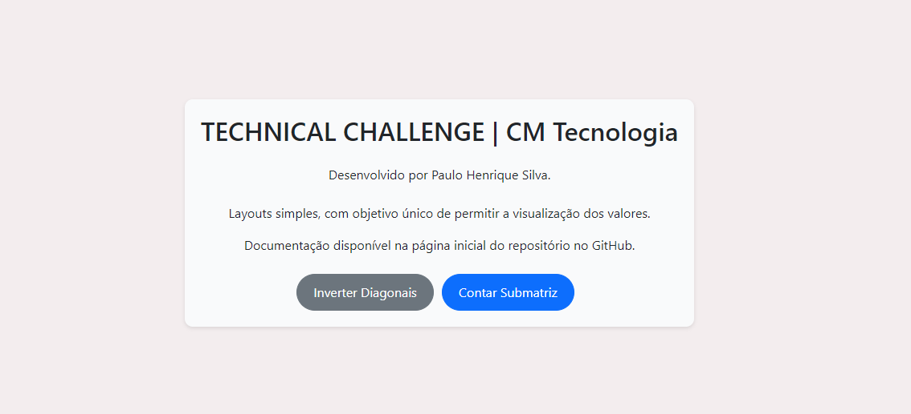
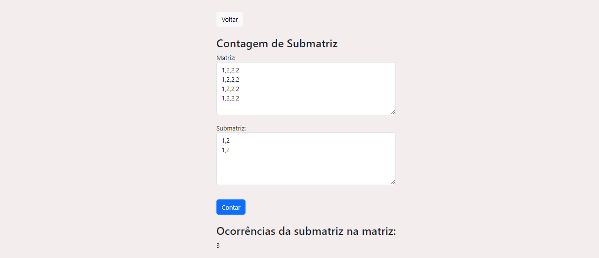

# CMMatrixSolverVisuals
Frontend do desafio técnico proposto pela CM Tecnologia.
Contém um aplicativo VueJS simples que consome duas APIs para operações em matrizes.
Utiliza Bootstrap.
Documentação completa encontra-se no [repositório do backend.](https://github.com/theSilvaPaulo/CMMatrixSolver)

